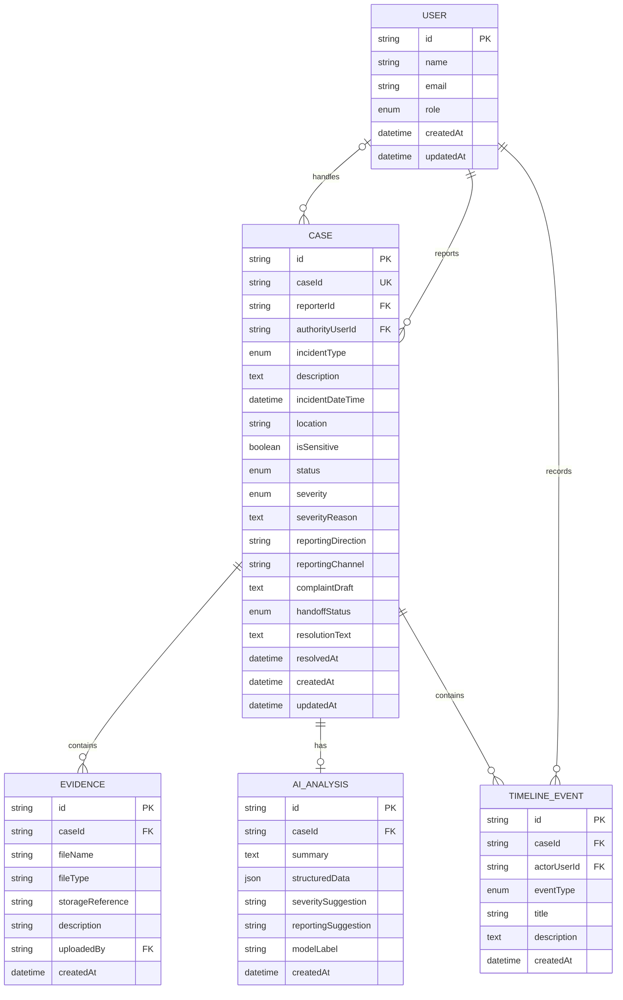

# CivicProof — Database Design

## Purpose

This document defines the **minimum persistent data model required by the CivicProof MVP**.

It is derived from `docs/01-PROBLEM.md` through `docs/06-ARCHITECTURE-DECISION.md`.

The goal is to support one complete journey:

```text
Incident
  ↓
Evidence
  ↓
AI-assisted analysis
  ↓
Complaint / official handoff state
  ↓
Case ID + timeline
  ↓
Authority review
  ↓
Status update
  ↓
Resolution
```

Only data required to support that MVP journey is included. No speculative tables are added for future features.

---

# 1. What Data Must Persist?

| Data | Why it must persist |
|---|---|
| **User identity and role** | The system must distinguish reporters from authority users and enforce access to sensitive cases and authority-only actions. |
| **Case / incident information** | The central product object must survive after report creation so it can be reviewed, tracked, and resolved. |
| **Evidence references** | Evidence must remain associated with the correct case and be accessible according to permissions. |
| **AI analysis** | The MVP needs to display the AI-assisted summary and severity/reporting assistance after analysis. |
| **Complaint information** | The generated complaint must remain associated with the case so the reporter can review it and the system can represent its handoff state. |
| **Timeline events** | Case progress must be represented chronologically and only show states/events that actually occurred in the prototype. |
| **Resolution information** | A resolved case needs a recorded resolution state and explanation that can be shown to the reporter. |

### Important design choice

The MVP does **not** need separate tables for every concept in the UI.

For example:

- Severity can be fields on `Case`.
- Reporting direction can be fields on `Case`.
- Complaint/handoff state can be fields on `Case`.
- Resolution can initially be fields on `Case`.
- Authority progress updates can be represented by `TimelineEvent`.

This keeps the database small and appropriate for a four-hour hackathon.

---

# 2. Entities and Fields

## 2.1 User

Represents a person who can use CivicProof.

### Fields

| Field | Purpose |
|---|---|
| `id` | Unique internal user identifier |
| `name` | Display name |
| `email` | User identity/contact identifier |
| `role` | `CITIZEN` or `AUTHORITY` |
| `createdAt` | When the account was created |
| `updatedAt` | Last profile update |

### Ownership

A citizen owns the cases they create.

An authority user does not own citizen cases simply by being an authority; they receive access through the case's authority workflow.

### Notes

`role` is sufficient for the MVP. A separate roles table is not required.

A separate organization/authority table is also not required because the MVP does not need a full multi-organization authority-management system.

---

# 2.2 Case

The central entity representing a reported incident/problem.

### Fields

| Field | Purpose |
|---|---|
| `id` | Internal unique identifier |
| `caseId` | Human-readable case/reference ID shown to the user |
| `reporterId` | User who created/reported the case |
| `incidentType` | Civic, public-service, harassment/safety, etc. |
| `description` | Original user-provided description |
| `incidentDateTime` | When the incident occurred, if supplied |
| `location` | Location information, if relevant/available |
| `isSensitive` | Whether the case requires private handling |
| `status` | Current case status |
| `severity` | AI-suggested severity |
| `severityReason` | Short explanation for the suggestion |
| `reportingDirection` | Recommended authority/reporting direction |
| `reportingChannel` | Official channel/handoff information |
| `complaintDraft` | Generated complaint text |
| `handoffStatus` | Draft / ready / handed off / confirmed, as actually supported |
| `authorityUserId` | Authority user currently handling the case, if applicable |
| `resolutionText` | Recorded resolution information |
| `resolvedAt` | When the case was recorded as resolved |
| `createdAt` | Case creation time |
| `updatedAt` | Last case update time |

### Why these fields belong on Case

The MVP treats the case as the single source of truth for the current state of the report.

The MVP does not require separate reusable entities for:

- Incident type
- Severity
- Reporting direction
- Complaint
- Handoff
- Resolution

Those are attributes/states of a case in the current scope.

### Sensitive cases

For sensitive cases:

```text
Case.isSensitive = true
```

The application must enforce private access based on this state.

The database should not contain a public-facing alleged-offender entity or public accusation data.

---

# 2.3 Evidence

Represents a file attached to a case.

### Fields

| Field | Purpose |
|---|---|
| `id` | Unique evidence identifier |
| `caseId` | Case to which the evidence belongs |
| `fileName` | Original/display file name |
| `fileType` | MIME/type information |
| `storageReference` | Reference to where the actual file is stored |
| `description` | Optional user-provided description |
| `uploadedBy` | User who uploaded the evidence |
| `createdAt` | Upload time |

### Important distinction

The database stores the **reference and metadata** for the evidence.

The actual file bytes should not be placed directly into the case record.

The MVP also must not treat an uploaded file as automatically authentic, conclusive, or legally admissible.

---

# 2.4 AIAnalysis

Represents an AI-generated interpretation associated with a case.

### Fields

| Field | Purpose |
|---|---|
| `id` | Unique analysis identifier |
| `caseId` | Case analyzed |
| `summary` | Structured/condensed incident summary |
| `structuredData` | Structured information extracted from supplied content |
| `severitySuggestion` | AI-generated severity suggestion |
| `reportingSuggestion` | AI-generated reporting-direction assistance |
| `modelLabel` | Identifier/label for the AI system used |
| `createdAt` | When the analysis was produced |

### Why this is a separate entity

The MVP needs to distinguish **user-provided information** from **AI-generated interpretation**.

Keeping AI output separate makes that distinction explicit and avoids overwriting the reporter's original description.

The MVP does not require an elaborate AI audit/event system, so one analysis record per case is sufficient for the initial model.

---

# 2.5 TimelineEvent

Represents an actual event in the case lifecycle.

### Fields

| Field | Purpose |
|---|---|
| `id` | Unique event identifier |
| `caseId` | Case associated with the event |
| `eventType` | Type of event |
| `title` | Human-readable event title |
| `description` | Event/progress details |
| `actorUserId` | User who caused/recorded the event, if applicable |
| `createdAt` | Event timestamp |

### Example event types

```text
CASE_CREATED
AI_ANALYSIS_COMPLETED
COMPLAINT_PREPARED
OFFICIAL_HANDOFF
AUTHORITY_REVIEW
STATUS_UPDATED
RESOLUTION_RECORDED
```

The exact list can be implemented as an enum rather than another database table.

### Why this entity is necessary

The citizen needs a chronological case timeline.

Using a dedicated event entity prevents the system from having to infer historical progress from the current `Case.status`.

Only actual recorded events should appear as completed timeline events.

---

# 3. Relationships

## User → Case

```text
One User (citizen) can create many Cases.
Each Case has one reporter.
```

Relationship:

```text
User 1 ──────── * Case
       reporter
```

---

## Case → Evidence

```text
One Case can have zero or many Evidence records.
Each Evidence record belongs to exactly one Case.
```

Relationship:

```text
Case 1 ──────── * Evidence
```

A case can therefore exist without evidence.

---

## Case → AIAnalysis

```text
One Case can have one current MVP AIAnalysis record.
```

Relationship:

```text
Case 1 ──────── 0..1 AIAnalysis
```

The `0..1` relationship allows a case to exist even if AI is unavailable or has not yet been run.

---

## Case → TimelineEvent

```text
One Case has many TimelineEvents.
Each TimelineEvent belongs to one Case.
```

Relationship:

```text
Case 1 ──────── * TimelineEvent
```

---

## User → TimelineEvent

A user may create/record many timeline events.

```text
User 1 ──────── * TimelineEvent
       actor
```

Some system-generated events can have a null `actorUserId`.

---

## Authority User → Case

An authority user can handle multiple cases.

A case may have zero or one currently assigned authority user in the MVP.

```text
User (authority)
       1
       │
       │ authorityUserId
       │
       *
     Case
```

This field supports the demo authority workflow without requiring a separate assignment table.

---

# 4. Data Ownership

| Data | Owner / Controller | Who can read it? | Who can write it? |
|---|---|---|---|
| **User** | The user/account system | Authenticated user; appropriate server-side operations | User/account system |
| **Case** | Reporter, with authority workflow access | Reporter + authorized authority | Reporter creates/updates allowed fields; authority updates authority-controlled fields |
| **Evidence** | Case/reporting user | Reporter + authorized authority | Authorized case participants |
| **AIAnalysis** | Case | Reporter + authorized authority | Backend/AI workflow |
| **TimelineEvent** | Case | Reporter + authorized authority | Backend and authorized authority workflow |
| **Resolution fields** | Case | Reporter + authorized authority | Authorized authority workflow |

### Sensitive case rule

If:

```text
Case.isSensitive = true
```

then:

- The case must not appear in public views.
- Evidence must not be publicly accessible.
- Unrelated citizens must not be able to retrieve it.
- Authority access must be explicitly authorized.
- Alleged-offender information must not become a public feed.

---

# 5. Data Lifecycle

## 5.1 User

```text
Account created
      ↓
Used for authentication/access control
      ↓
May create or handle cases
      ↓
Account remains while needed
```

The MVP does not require account deletion workflows beyond whatever the authentication layer provides.

---

## 5.2 Case

```text
Create
  ↓
Collect incident details
  ↓
Attach evidence (optional)
  ↓
AI analysis
  ↓
Complaint preparation
  ↓
Official handoff state
  ↓
Authority review
  ↓
Progress updates
  ↓
Resolution
```

### Updates

A case is updated when:

- User submits or edits permitted incident information
- AI analysis is completed
- Complaint draft is generated/edited
- Handoff state changes
- Authority reviews/updates the case
- Resolution is recorded

### Deletion

**Hard deletion is not required as an MVP workflow.**

Because cases may contain sensitive evidence and a case timeline, accidental deletion would be risky during the demo.

If deletion is needed later, retention/deletion rules should be designed deliberately rather than implementing an arbitrary delete button.

---

## 5.3 Evidence

```text
Upload
  ↓
Associate with Case
  ↓
View according to permissions
  ↓
Retain while case requires it
```

The MVP does not require evidence versioning, forensic chain-of-custody, authenticity verification, or automated deletion policies.

---

## 5.4 AIAnalysis

```text
Case submitted for AI assistance
       ↓
AI analysis created
       ↓
Displayed as AI-generated
       ↓
Associated with case
```

If AI fails:

```text
No fake analysis record
       ↓
Case remains available
```

This follows the requirement that an AI failure must not be represented as a successful AI result.

---

## 5.5 TimelineEvent

Timeline events are append-oriented:

```text
Event occurs
   ↓
TimelineEvent created
   ↓
Event remains in chronological history
```

Existing timeline events should not normally be overwritten because they represent historical case progress.

---

# 6. Read / Write Patterns

## Citizen reads

Typical citizen operations:

- View their case
- View case status
- View timeline
- View their evidence
- View AI analysis
- View/edit complaint before handoff
- View reporting direction
- View recorded resolution

## Citizen writes

Typical citizen operations:

- Create a case
- Add incident details
- Upload evidence
- Request AI analysis
- Generate/edit complaint
- Continue the official handoff workflow where supported

---

## Authority reads

Typical authority operations:

- View cases available/assigned to them
- View case details
- View evidence according to permissions
- View AI-assisted summary
- View severity
- View timeline
- View reporting/handoff state

## Authority writes

Typical authority operations:

- Update status
- Add progress information
- Record resolution
- Add corresponding timeline events

Assignment is P1 in the requirements, so the MVP does **not** require a complex assignment-management data model.

---

# 7. Expected Scale

The hackathon MVP should be designed for a **small demonstration-scale workload**, not production-scale government traffic.

Expected characteristics:

- Small number of users
- Small number of cases
- Low concurrent usage
- Small number of evidence files per case
- Mostly simple CRUD reads/writes
- AI requests triggered by user actions
- Timeline reads ordered by case and timestamp

### Important implication

There is no reason for the MVP database to require:

- Sharding
- Distributed databases
- Event-streaming infrastructure
- Read replicas
- Complex caching layers
- Search clusters

A conventional persistent relational data model is sufficient.

These are future scaling concerns, not MVP requirements.

---

# 8. Basic Security and Access Notes

## Authentication boundary

Every protected request should be associated with an authenticated user.

The backend should determine the user's identity and role rather than trusting a client-provided role.

---

## Case access

### Citizen

A citizen should only be able to access cases they are authorized to view, normally:

```text
case.reporterId == currentUser.id
```

### Authority

An authority user should only access cases allowed by the authority workflow.

For the MVP this can be:

```text
case.authorityUserId == currentUser.id
```

or another explicitly controlled authority-access rule.

### Public users

Public access should **not** expose sensitive cases or their evidence.

---

## Sensitive cases

Sensitive cases require stronger access checks:

```text
isSensitive = true
        ↓
No public access
        ↓
Reporter + authorized authority only
```

The case ID alone must not be treated as sufficient authorization to retrieve a sensitive case.

---

## Evidence

Evidence access must be checked against the case permissions.

A user must not be able to access an evidence file simply by guessing its storage reference or evidence ID.

---

## Authority-only writes

Operations such as:

- Status changes
- Progress updates
- Resolution recording

must be rejected for ordinary citizen users.

---

## AI data handling

Only information necessary for the requested AI operation should be sent to the AI component.

AI-generated content must be stored/returned as AI-generated content and must not silently overwrite original user-provided facts.

---

# 9. Minimal ER Diagram



---

# 10. Why There Are Only Five Tables

The MVP needs exactly five persistent entities:

```text
USER
  │
  └── CASE
        ├── EVIDENCE
        ├── AI_ANALYSIS
        └── TIMELINE_EVENT
```

### Deliberately NOT separate tables

| Candidate table | Decision | Why |
|---|---|---|
| `IncidentType` | **Not needed** | A small fixed set of categories can be an enum/value rather than a table. |
| `Severity` | **Not needed** | Severity is a property of a case/AI analysis, not an independently managed entity. |
| `Authority` | **Not needed** | The MVP only needs authority users and reporting-direction information; it does not require a full authority directory. |
| `Assignment` | **Not needed** | Assignment is P1; a current authority user reference is enough for the MVP. |
| `Complaint` | **Not needed** | The MVP only needs one complaint draft/state per case. |
| `Resolution` | **Not needed** | One recorded resolution can be stored on the case. |
| `Handoff` | **Not needed** | The MVP needs handoff state, not a separate integration transaction system. |
| `Notification` | **Not needed** | Notifications are explicitly outside the MVP. |
| `AuditLog` | **Not needed** | Timeline events cover the MVP's visible case history; a separate enterprise audit system is unnecessary for the hackathon. |
| `LegalRule` / `Regulation` | **Not needed** | Regulatory context is P1 and the MVP does not require a full legal knowledge system. |
| `Organization` | **Not needed** | Multi-organization authority management is outside the MVP. |
| `PublicReport` | **Not needed** | The MVP does not have a public incident feed/map. |

---

# Final Database Decision

The MVP requires a **small persistent relational model** centered on `Case`.

```text
User
  ↓
Case
  ├── Evidence
  ├── AIAnalysis
  └── TimelineEvent
```

This is enough to prove the complete product journey without introducing speculative infrastructure.

The key principle is:

> **Persist the state needed to continue and verify the case journey — not every concept that might exist in a future version of CivicProof.**
