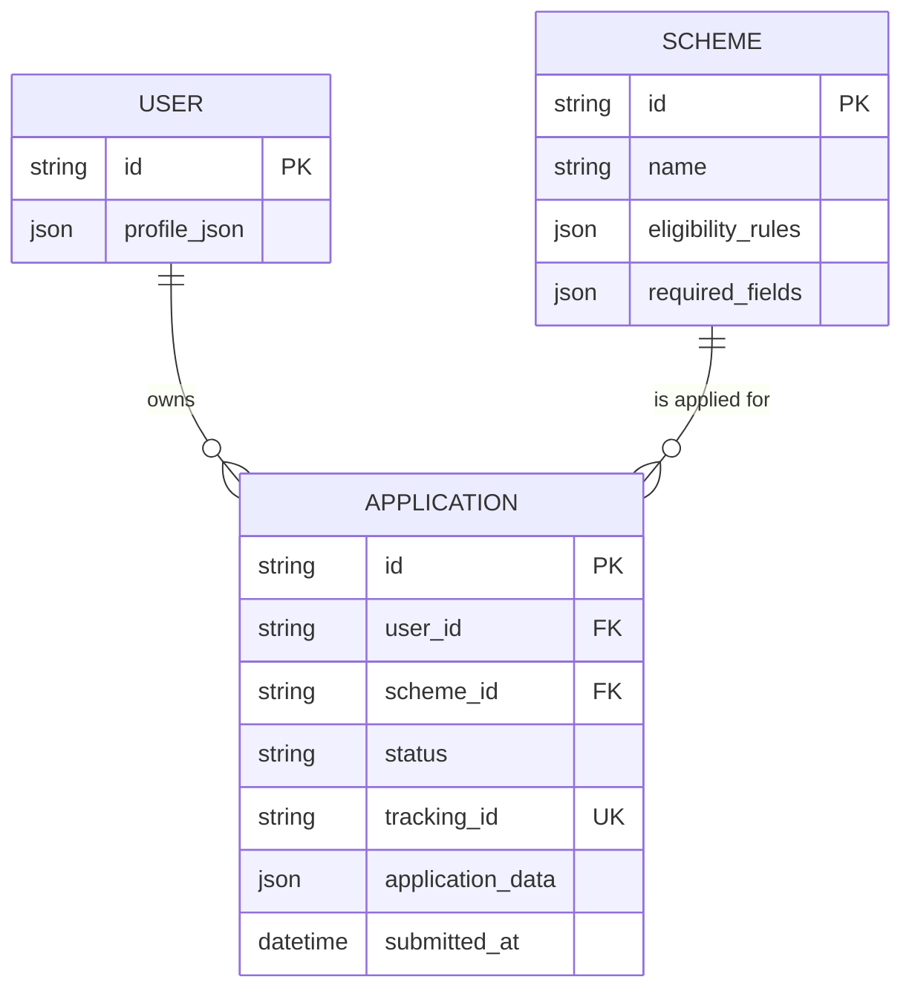

# 07 — Database Design

This document defines the minimum persistent data model required by the MVP described in `01-PROBLEM.md` through `06-ARCHITECTURE-DECISION.md`.

The design intentionally remains small. The MVP supports one demonstration welfare scheme, a bounded eligibility/application flow, simulated submission, and later status lookup. No production-scale entities or speculative tables are introduced.

---

# 1. What Data Must Persist?

The MVP needs to persist only the information required to support the journey across turns and after simulated submission.

| Data | Why it must persist |
|---|---|
| **Scheme definition** | The system needs a stable source for the supported scheme's eligibility criteria and application requirements. |
| **User/demo identity and profile** | The system needs to associate an application with the citizen/demo user and retrieve that user's application later. |
| **Application information** | The filled and confirmed application must survive the submission interaction and be associated with a tracking ID. |
| **Application status** | The user must be able to ask for their status later. |
| **Tracking ID and submission time** | The user needs a persistent reference to the simulated application and when it was submitted. |

The MVP does **not** require a separate conversation-history table. The minimum conversation/application state can be maintained as part of the active application/session mechanism, while the final application data is persisted in `APPLICATION`.

If implementation requires temporary conversation state to survive page refreshes or separate sessions, it should remain an implementation detail unless the requirements later justify a dedicated persistent entity.

---

# 2. Entities

The MVP has three core entities:

```text
USER
  │
  │ 1:N
  ▼
APPLICATION
  │
  │ N:1
  ▼
SCHEME
```

## 2.1 USER

Represents the citizen/demo identity to whom an application belongs.

### Fields

| Field | Type / Shape | Required | Purpose |
|---|---|---:|---|
| `id` | Unique identifier | Yes | Identifies the user/demo citizen. |
| `profile_json` | Structured JSON | Yes | Stores the citizen information needed by the MVP, such as facts collected during the interaction that are relevant to the application. |

### Ownership

The user owns their own profile information and the applications associated with them.

### Notes

Full identity/authentication infrastructure is outside the MVP. `USER` exists only because applications need an owner and later status lookup needs a way to associate the application with the demo user.

The profile should contain only information required by the supported scheme/application flow.

---

# 2.2 SCHEME

Represents a welfare scheme supported by the MVP.

Although the MVP currently targets one demonstration scheme, keeping scheme information as an entity avoids hard-coding the scheme directly into application records and leaves room for the explicitly permitted 1–2 scheme scope.

### Fields

| Field | Type / Shape | Required | Purpose |
|---|---|---:|---|
| `id` | Unique identifier | Yes | Identifies the scheme. |
| `name` | Text | Yes | Citizen-facing scheme name. |
| `eligibility_rules` | Structured JSON | Yes | Defines the eligibility criteria used by the eligibility evaluation. |
| `required_fields` | Structured JSON | Yes | Defines the application information needed to prepare the application. |

### Ownership

Scheme definitions are controlled by the application/product team for the purposes of the hackathon prototype.

### Notes

The scheme's eligibility rules are a controlled data source for the eligibility workflow. They should not be replaced by unrestricted model-generated rules.

The exact rules and fields must correspond to the selected demonstration scheme. Example criteria such as age, income, land ownership, or residency should not be stored as official scheme rules until the actual scheme is selected and its requirements are established.

---

# 2.3 APPLICATION

Represents a citizen's application for a supported scheme.

### Fields

| Field | Type / Shape | Required | Purpose |
|---|---|---:|---|
| `id` | Unique identifier | Yes | Internal application identifier. |
| `user_id` | Foreign key → `USER.id` | Yes | Identifies the citizen who owns the application. |
| `scheme_id` | Foreign key → `SCHEME.id` | Yes | Identifies the scheme being applied for. |
| `status` | Controlled status value | Yes | Stores the current simulated application state. |
| `tracking_id` | Unique text identifier | Yes after submission | Public/demo reference returned to the citizen. |
| `application_data` | Structured JSON | Yes | Stores the prepared and user-confirmed application information. |
| `submitted_at` | Date/time | No until submission | Records when the simulated application was submitted. |

### Ownership

The application belongs to the user identified by `user_id`.

The application references the scheme used to create it, but the user owns the application record.

### Notes

`application_data` is intentionally kept as structured data rather than creating a separate table for every possible form field. The MVP supports only one scheme, so a flexible application payload avoids unnecessary schema complexity.

---

# 3. Relationships

## USER → APPLICATION

**One user can have zero or more applications.**

```text
USER 1 ─────────── N APPLICATION
```

### Relationship purpose

The relationship allows the system to:

- Associate an application with its citizen.
- Retrieve the user's submitted application later.
- Support the "What's my status?" flow.

---

## SCHEME → APPLICATION

**One scheme can have zero or more applications.**

```text
SCHEME 1 ───────── N APPLICATION
```

### Relationship purpose

The relationship allows the system to:

- Know which scheme an application belongs to.
- Apply the appropriate scheme requirements.
- Keep application data connected to the scheme used to create it.

---

# 4. Ownership and Access

The MVP does not implement full authentication, but the data model should still follow basic ownership boundaries.

## User-owned data

A user should only be able to access application information associated with their own demo identity/session.

This applies particularly to:

- `USER.profile_json`
- `APPLICATION.application_data`
- `APPLICATION.tracking_id`
- `APPLICATION.status`
- `APPLICATION.submitted_at`

## Scheme data

Scheme definitions are application-controlled data:

- `SCHEME.name`
- `SCHEME.eligibility_rules`
- `SCHEME.required_fields`

Citizens consume this information through the application flow; they should not be able to arbitrarily change the scheme's eligibility rules.

## Backend-controlled application state

The application status and submission timestamp should be controlled by the application workflow rather than being freely editable by the citizen.

---

# 5. Application Lifecycle

The database must support the following conceptual lifecycle:

```text
Conversation begins
       ↓
User information collected
       ↓
Scheme identified
       ↓
Eligibility evaluated
       ↓
Application prepared
       ↓
Application reviewed
       ↓
User confirms
       ↓
Application submitted (SIMULATED)
       ↓
Tracking ID assigned
       ↓
Status available for later lookup
```

## Suggested application states

The MVP needs only a small set of states.

### Before submission

- `DRAFT` — application information is being prepared/reviewed.

### After submission

- `SUBMITTED` — simulated submission has been recorded.
- `UNDER_REVIEW` — optional simulated progression state if the demo shows processing.
- `APPROVED` — optional simulated outcome for the demo.
- `REJECTED` — optional simulated outcome for the demo.

The exact status progression should remain minimal and should only include states needed by the demo.

### Important boundary

These are **simulated application states**, not real government processing states.

The UI must make this distinction clear.

---

# 6. Data Lifecycle

## User/Profile

Created when a demo user first enters the application flow or when a demo identity is established.

Updated when the user provides or corrects relevant information.

Retained for as long as the MVP needs to associate the user's applications with them.

---

## Scheme

Created/configured by the application team before the demo.

Read during:

- Scheme matching.
- Eligibility evaluation.
- Application preparation.

Not modified by ordinary citizen interactions.

---

## Application

### Draft

Created when the application preparation stage begins.

### Review

Updated if the citizen corrects information before submission.

### Submitted

Once the citizen explicitly confirms the application, the prototype records the simulated submission and assigns a tracking ID.

### Status

The simulated status may change during the demo so that the status-lookup flow can be demonstrated.

---

# 7. Data Needed for Eligibility

The eligibility workflow requires structured facts about the citizen.

For example, a selected scheme might require facts such as:

```json
{
  "age": "...",
  "incomeBracket": "...",
  "landOwnership": "...",
  "residency": "..."
}
```

These are **illustrative shapes only**, not the official rules for the final scheme.

The important architectural requirement is that:

```text
Natural-language conversation
          ↓
Structured citizen facts
          ↓
Defined scheme eligibility rules
          ↓
Eligibility result
```

The database therefore needs somewhere to persist the relevant structured information. For the MVP, `USER.profile_json` and/or the relevant `APPLICATION.application_data` can hold these facts without introducing a separate eligibility entity.

---

# 8. Why We Do Not Add More Tables

The following entities are intentionally **not** separate tables in this MVP:

| Potential entity | Decision | Reason |
|---|---|---|
| `ELIGIBILITY_RESULT` | ❌ Not needed | The eligibility result can be derived from the user's facts and the scheme rules. |
| `ELIGIBILITY_CRITERION` | ❌ Not needed | One scheme with 3–4 simple criteria does not justify a separate relational entity. |
| `APPLICATION_FIELD` | ❌ Not needed | `application_data` can hold the small scheme-specific form payload. |
| `DOCUMENT` | ❌ Not needed | Document upload/OCR is explicitly outside the MVP. |
| `STATUS_HISTORY` | ❌ Not needed | The MVP only requires current simulated status; a history table would be overbuilding unless the demo specifically requires status history. |
| `CONVERSATION` | ❌ Not needed initially | The core requirement is current application/session state, not a production conversation archive. |
| `MESSAGE` | ❌ Not needed | Persisting every chat message is not required by the MVP. |
| `DEPARTMENT` | ❌ Not needed | The MVP supports one selected scheme and does not require department routing. |
| `NOTIFICATION` | ❌ Not needed | Proactive reminders are outside the MVP. |

This keeps the data model proportional to the hackathon scope.

---

# 9. Mermaid ER Diagram



---

# 10. Basic Access Rules

The MVP should follow these basic rules:

| Data / Action | Access |
|---|---|
| Read supported scheme information | Application workflow |
| Modify scheme eligibility rules | Application/admin-controlled only |
| Read own profile | Current demo user |
| Update own relevant profile information | Current demo user through the application flow |
| Create application | Current demo user |
| Read own application | Current demo user |
| Update draft application | Current demo user before confirmation |
| Confirm application | Current demo user |
| Simulate submission | Current demo user after confirmation |
| Read own status | Current demo user |
| Modify submitted application | Not allowed through the normal citizen flow |
| Modify application status | Application-controlled simulated workflow |

Because full authentication is excluded, the exact mechanism used to identify the current demo user is intentionally left to implementation design.

---

# 11. Database Design Principles

### Keep the schema small

The MVP does not need a production government data platform.

### Persist only what the user journey requires

Every persistent field should support at least one of:

- Eligibility.
- Application preparation.
- User confirmation.
- Simulated submission.
- Tracking.
- Later status lookup.

### Keep scheme rules controlled

Eligibility rules should come from the defined scheme data rather than being invented dynamically by the AI.

### Keep application data flexible

The MVP's single-scheme scope does not justify creating a separate relational column/table for every form field.

### Protect ownership boundaries

Even without full authentication, the data model should make it possible to associate applications with the correct demo user and avoid exposing another user's application.

---

# 12. Final MVP Data Model

The minimum persistent model is:

```text
USER
 ├── id
 └── profile_json
       │
       │ owns
       ▼
APPLICATION
 ├── id
 ├── user_id
 ├── scheme_id
 ├── application_data
 ├── status
 ├── tracking_id
 └── submitted_at
       │
       │ references
       ▼
SCHEME
 ├── id
 ├── name
 ├── eligibility_rules
 └── required_fields
```

This is sufficient to support the MVP's core journey:

> **Describe situation → collect facts → evaluate eligibility → prepare application → review → confirm → simulated submission → tracking ID → later status lookup**

No additional persistent entities are required unless a later requirement explicitly introduces a need for them.
